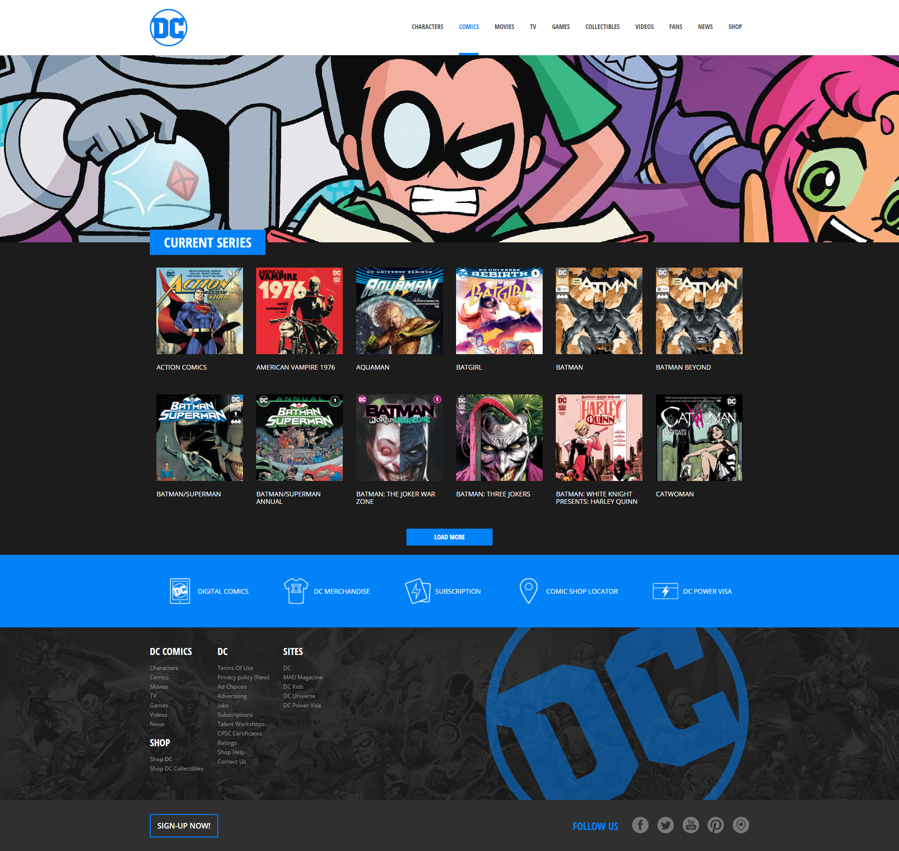

# DC Comics (React Components)

This is the 23rd exercise I have completed as part of the web development master. It focuses on advanced React architecture, component reusability, structural dynamic rendering using JSX iterations, data propagation via props, and hierarchical data centralization.

Repository name: `react-dc-comics`

## 📝 Task

The objective of this multi-phased assignment is to build a structured, dynamic, and fully styled replica of the DC Comics homepage layout using React components.

### Milestone 1: Layout & Component Structure
* **Scaffolding:** Initialize a new React project using the Vite build toolchain.
* **Architecture:** Define and arrange the foundational components needed to construct the layout grid (Header, Main, NavMenu, Footer).
* **Typography:** Integrate the *Open Sans* font family across the application styling sheets.
* **Priority:** Solidify structural element placement prior to executing final CSS aesthetics.

### Milestone 2: Dynamic Content & JSX Iteration
* **Navbar Dinamicization:** Implement data collections to drive the global navigation components dynamically using JSX map loops.
* **Content Population:** Bind local data arrays to automatically render comic series entries.
* **Polishing:** Finalize comprehensive layout properties, spacing systems, and decorative visual details utilizing individual component CSS modules.

### Milestone 3: Reusable Comic Cards & Props
* **Component Abstraction:** Design a dedicated, isolated `ComicCard` component responsible for displaying individual comic item cards.
* **Data Flow:** Configure the card child component to receive single comic entity datasets dynamically from its parent wrapper via custom React props.

### 🌟 Bonus
* **Icon Banner Component:** Create an isolated utility banner component to manage the lower blue section holding interactive merchant icons.
* **Dynamic Footer Links:** Structure a matrix data array representing multi-category footer directory columns and loop over them via JSX iterations.
* **Data Centralization:** Centralize global datasets inside the root `App.jsx` component level, distributing records downwards to target UI nodes through cascading props.

## 📷 Reference Webpage



## 📂 Project Structure

```text
react-dc-comics/
├── node_modules/
├── public/
│   ├── img/
│   │   ├── buy-comics-digital-comics.png
│   │   ├── buy-comics-merchandise.png
│   │   ├── buy-comics-shop-locator.png
│   │   ├── buy-comics-subscriptions.png
│   │   ├── buy-dc-power-visa.svg
│   │   ├── dc-logo-bg.png
│   │   ├── dc-logo.png
│   │   ├── footer-bg.jpg
│   │   ├── footer-facebook.png
│   │   ├── footer-periscope.png
│   │   ├── footer-pinterest.png
│   │   ├── footer-twitter.png
│   │   ├── footer-youtube.png
│   │   └── jumbotron.jpg
│   └── favicon.ico
├── src/
│   ├── components/
│   │   ├── ComicCard.css
│   │   ├── ComicCard.jsx
│   │   ├── Comics.css
│   │   ├── Comics.jsx
│   │   ├── Footer.css
│   │   ├── Footer.jsx
│   │   ├── Header.css
│   │   ├── Header.jsx
│   │   ├── MainApp.css
│   │   ├── MainApp.jsx
│   │   ├── NavMenu.css
│   │   └── NavMenu.jsx
│   ├── App.css
│   ├── App.jsx
│   ├── index.css
│   └── main.jsx
├── .gitignore
├── .oxlintrc.json
├── comics.js
├── dc-comics-empty-layout.png
├── index.html
├── package-lock.json
├── package.json
├── README.md
├── screenshot.png
└── vite.config.js
```

## 🛠️ Technologies Used
* HTML5: Semantic structure.
* CSS3: Custom styling and layout.
* JavaScript (ES6): Logic, data processing, and DOM manipulation.
* React: Frontend library framework.
* Vite: Build tool and development server.
* VSCode: IDE.